# roborl

**Learning reinforcement learning for robotics by building it.**

[](https://github.com/fsafaei/roborl/actions/workflows/ci.yml)
[](pyproject.toml)
[](https://github.com/astral-sh/ruff)
[](LICENSE)

Every algorithm here is implemented from scratch, **verified against
reference implementations** (primarily [CleanRL](https://docs.cleanrl.dev))
before it counts as done, and instrumented so its behavior can actually be
understood. The destination is contact-rich robotic manipulation; the road
starts deliberately simple, with classic control.

## Why this repo exists

**Implementing and verifying beats reading.** You don't understand an RL
algorithm until your from-scratch implementation matches a trusted reference
on standard benchmarks — with honest statistics, not a cherry-picked seed.
Verification against CleanRL's public benchmark runs is built into the
workflow here, not bolted on.

**Debugging and telemetry literacy are the actual skills.** Most of applied
RL is diagnosing silently-wrong training runs. This repo treats that as
first-class curriculum: a [debugging protocol](docs/debugging-rl.md), a
[guide to reading training metrics](docs/telemetry.md), and a lab notebook
of real investigations — the failure modes are documented next to the code
that produces them.

**The road goes toward contact-rich manipulation, starting simple on
purpose.** Classic control → continuous control → goal-conditioned RL →
manipulation (peg-in-hole, nut assembly, wiping). Deep algorithmic
understanding first; robotic complications once the foundations are proven.

Positioning among neighbors: [CleanRL](https://github.com/vwxyzjn/cleanrl)
is the reference oracle, [Spinning Up](https://spinningup.openai.com) the
theory companion; roborl is the learn-by-building-with-engineering-rigor
layer on top — typed, tested, CI-gated, with recorded design decisions.

## Quickstart

```bash
git clone https://github.com/fsafaei/roborl && cd roborl
uv sync                        # add --extra mujoco for MuJoCo envs
uv run roborl demo             # random agent on CartPole — verifies the whole pipeline
uv run pytest -m "unit or smoke"
```

Install matrix ([details](docs/setup.md)):

| Machine | Command |
|---|---|
| macOS (Apple Silicon → MPS) | `uv sync` |
| Linux with NVIDIA GPU | `uv sync` |
| Linux CPU-only / CI | `uv sync --extra cpu` |

**Weights & Biases** (optional): telemetry is off by default. `wandb login`
once, then re-run the demo with `--track` to see it live in W&B. On machines
without internet, `WANDB_MODE=offline uv run roborl demo --track` records
locally for later `wandb sync`.

## Repository map

```
src/roborl/
├── cli.py           # `roborl` CLI: demo, sac, ppo, flashsac, benchmark ...
├── config.py        # one frozen dataclass = one experiment
├── demo.py          # random-agent pipeline check — template for training scripts
├── utils/           # seeding, device resolution (cuda > mps > cpu)
├── envs/factory.py  # seeded env thunks with episode-stats & video wrappers
├── telemetry/       # W&B wrapper (online/offline/disabled) + canonical metric names
├── benchmark/       # reference fetching, IQM/CI statistics, plots, reports
└── algos/           # sac, ppo (discrete + continuous), flashsac — one package each
docs/                # setup, telemetry, debugging, lifecycle, benchmarking, ADRs, lab notebook
benchmarks/reports/  # committed verification reports (the evidence)
tests/               # unit + smoke (CPU, offline, fast)
```

## Algorithms & status

Statuses: `planned → in progress → implemented → verified ✅` — where
`verified ✅` requires a committed verification report. Every verified
algorithm has a full results section below with the numbers, the curves,
and every link you might want.

| Algorithm | Envs | Status | Verified against | Results |
|---|---|---|---|---|
| SAC | Pendulum, MuJoCo | verified ✅ | CleanRL | [↓ SAC results](#sac) |
| PPO (discrete) | CartPole, Acrobot, MountainCar, LunarLander | verified ✅ | CleanRL | [↓ PPO discrete results](#ppo-discrete) |
| PPO (continuous) | Pendulum, MuJoCo | verified ✅ | CleanRL | [↓ PPO continuous results](#ppo-continuous) |
| FlashSAC ([Kim et al., 2026](https://arxiv.org/abs/2604.04539)) | MuJoCo (authors' CPU recipe) | verified ✅ (vs roborl SAC) | roborl SAC (no CleanRL reference) | [↓ FlashSAC results](#flashsac) |
| HER + SAC | Fetch (Reach, Push, PickAndPlace) | planned | SB3/zoo + published results | — |

Beyond these, the roadmap ends in **vision-language-action (VLA) policies**
for manipulation — a research phase building on existing open VLA models
rather than a from-scratch reimplementation, so it lives in the roadmap
below rather than this table.

## Results

Every number below is copied from a committed verification report, and
every curve traces to a tracked W&B run (config + git SHA recorded).
Four ways in, depending on what you want:

| You want… | Where to go |
|---|---|
| **Interactive curves with explanations** | the 📈 *W&B report* link under each algorithm |
| **The verdict and the exact numbers** | the **PASS** link on each table row (the committed report) |
| **Every raw run, filterable and grouped** | the 🗂 *W&B workspace* link |
| **How it was built, and every pitfall hit** | the 📝 *spec note* link (`docs/algos/`) |

**How to read the tables:** IQM of `charts/episodic_return` over the last
10% of training, with 95% stratified bootstrap confidence intervals over
5 seeds ([Agarwal et al., NeurIPS 2021](https://arxiv.org/abs/2108.13264)).
**PASS** means our CI overlaps the reference's — a mechanical verdict from
`roborl benchmark compare`, never an eyeballed one. Full methodology:
[docs/benchmarking.md](docs/benchmarking.md).

### SAC

Soft Actor-Critic (Haarnoja et al., 2019), verified against CleanRL's
`sac_continuous_action` — 5 seeds × 1M steps per environment, CleanRL's
default hyperparameters, same environment versions.

| Environment | roborl IQM [95% CI] | CleanRL IQM [95% CI] | Verdict |
|---|---|---|---|
| Hopper-v4 | **3082** [2604, 3389] | 2366 [2045, 2721] | [**PASS**](benchmarks/reports/sac/Hopper-v4/report.md) |
| HalfCheetah-v4 | **10367** [8128, 11704] | 9750 [8608, 11083] | [**PASS**](benchmarks/reports/sac/HalfCheetah-v4/report.md) |
| Walker2d-v4 | **4610** [4204, 5059] | 3847 [3336, 4538] | [**PASS**](benchmarks/reports/sac/Walker2d-v4/report.md) |

📈 [W&B report](https://wandb.ai/fsafaei/roborl/reports/SAC-results--VmlldzoxNzgyNjA4Ng==) ·
🗂 [W&B workspace](https://wandb.ai/fsafaei/roborl?nw=tijcpaozy47) ·
📝 [spec note](docs/algos/sac.md) ·
📄 [committed reports](benchmarks/reports/sac)

<details>
<summary><b>Learning curves</b> — ours vs CleanRL, per environment (click to expand)</summary>

#### Hopper-v4
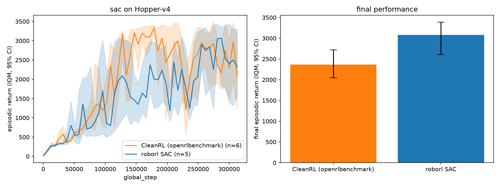
#### HalfCheetah-v4
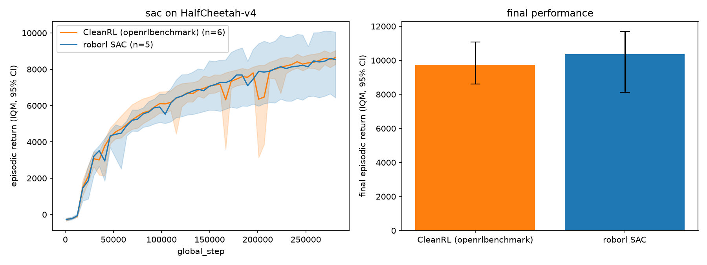
#### Walker2d-v4
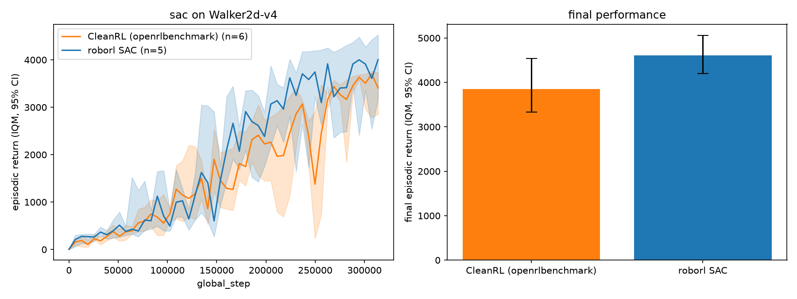

</details>

### PPO (discrete)

Proximal Policy Optimization (Schulman et al., 2017) with CleanRL's exact
implementation details, verified against CleanRL's `ppo` — 5 seeds × 500k
steps, CleanRL's default hyperparameters.

| Environment | roborl IQM [95% CI] | CleanRL IQM [95% CI] | Verdict |
|---|---|---|---|
| CartPole-v1 | **488.9** [472.2, 498.5] | 495.4 [488.3, 498.8] | [**PASS**](benchmarks/reports/ppo/CartPole-v1/report.md) |
| Acrobot-v1 | **-84.0** [-84.9, -82.8] | -84.6 [-86.3, -83.7] | [**PASS**](benchmarks/reports/ppo/Acrobot-v1/report.md) |
| MountainCar-v0 | **-200.0** [-200.0, -200.0] | -200.0 [-200.0, -200.0] | [**PASS**](benchmarks/reports/ppo/MountainCar-v0/report.md)¹ |
| LunarLander-v3 | **26.7** [8.6, 40.7] | — no CleanRL runs exist | [**N/A**](benchmarks/reports/ppo/LunarLander-v3/report.md)² |

¹ A floor-match: under reference hyperparameters *both* implementations sit
at exactly -200 (neither solves MountainCar) — matching the reference is
the claim, not solving the env.
² `openrlbenchmark` holds no CleanRL `ppo` runs on any LunarLander version;
per the integrity rules the report says so instead of inventing a verdict.

📈 [W&B report](https://wandb.ai/fsafaei/roborl/reports/PPO-(discrete)-results--VmlldzoxNzgyNjA5MA==) ·
🗂 [W&B workspace](https://wandb.ai/fsafaei/roborl?nw=olbo340c8wy) ·
📝 [spec note](docs/algos/ppo.md) ·
📄 [committed reports](benchmarks/reports/ppo)

<details>
<summary><b>Learning curves</b> — ours vs CleanRL, per environment (click to expand)</summary>

#### CartPole-v1

#### Acrobot-v1
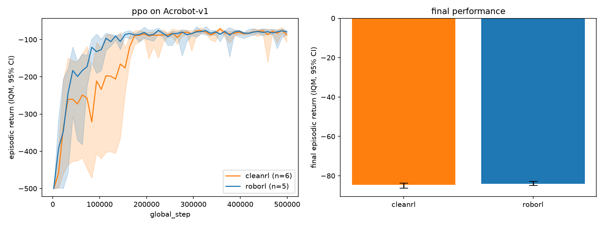
#### MountainCar-v0
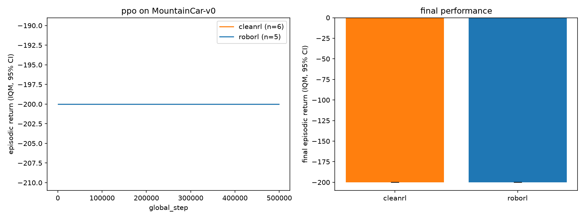

</details>

### PPO (continuous)

Continuous-action PPO sharing the discrete module's tested math, verified
against CleanRL's `ppo_continuous_action` — 5 seeds × 1M steps, CleanRL's
default hyperparameters.

| Environment | roborl IQM [95% CI] | CleanRL IQM [95% CI] | Verdict |
|---|---|---|---|
| HalfCheetah-v4 | **1622** [1421, 2188] | 1851 [1390, 3232] | [**PASS**](benchmarks/reports/ppo_continuous_action/HalfCheetah-v4/report.md) |
| Hopper-v4 | **2336** [1784, 2604] | 2177 [1930, 2537] | [**PASS**](benchmarks/reports/ppo_continuous_action/Hopper-v4/report.md) |
| Walker2d-v4 | **2999** [2436, 3356] | 2978 [2365, 3514] | [**PASS**](benchmarks/reports/ppo_continuous_action/Walker2d-v4/report.md) |

📈 [W&B report](https://wandb.ai/fsafaei/roborl/reports/PPO-(continuous)-results--VmlldzoxNzgyNjA5Mg==) ·
🗂 [W&B workspace](https://wandb.ai/fsafaei/roborl?nw=3wmwgm5mdsn) ·
📝 [spec note](docs/algos/ppo.md#continuous-actions-ppo_continuous_actionpy) ·
📄 [committed reports](benchmarks/reports/ppo_continuous_action)

<details>
<summary><b>Learning curves</b> — ours vs CleanRL, per environment (click to expand)</summary>

#### HalfCheetah-v4
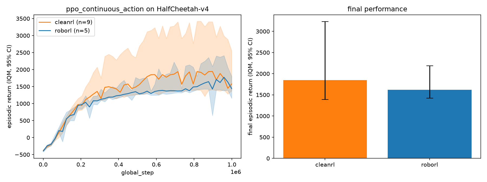
#### Hopper-v4
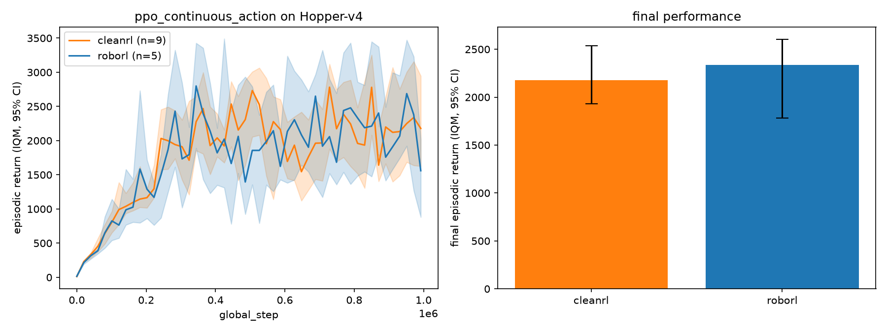
#### Walker2d-v4
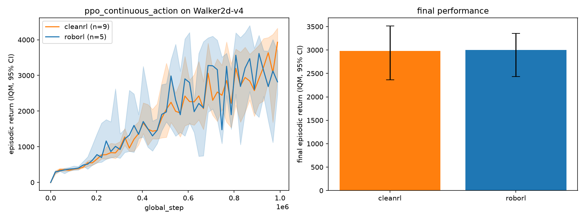

</details>

### FlashSAC

FlashSAC ([Kim et al., RSS 2026](https://arxiv.org/abs/2604.04539)) — SAC
plus six stability changes — implemented blind from the paper first, then
diffed component-by-component against the reference code (the adjudicated
diff table lives in the [spec note](docs/algos/flashsac.md)). Run with the
authors' own CPU/MuJoCo recipe, which exercises the paper's *stability*
half only; there is no CleanRL reference, so the comparison baseline is
**our CleanRL-verified SAC** at the same budget.

At this operating point (1 env, UTD 1) the harness verdict is a *parity*
test against a different algorithm, so it fires INVESTIGATE for
"significantly better" too — those rows link the lab-notebook diagnosis.

| Environment | FlashSAC IQM [95% CI] | roborl SAC IQM [95% CI] | Verdict |
|---|---|---|---|
| HalfCheetah-v4 | **12773** [12128, 13084] | 10367 [8128, 11704] | [**INVESTIGATE** → significant improvement](benchmarks/reports/flashsac/HalfCheetah-v4/report.md) ([diagnosis](docs/lab-notebook/2026-08-30-flashsac-halfcheetah-investigate.md)) |
| Hopper-v4 | **2968** [2916, 3203] | 3082 [2604, 3389] | [**PASS** — parity, tighter CI](benchmarks/reports/flashsac/Hopper-v4/report.md) |
| Walker2d-v4 | **6124** [5954, 6532] | 4610 [4204, 5059] | [**INVESTIGATE** → significant improvement](benchmarks/reports/flashsac/Walker2d-v4/report.md) ([diagnosis](docs/lab-notebook/2026-08-31-flashsac-walker2d-investigate.md)) |

These gains come from the paper's stability half only, and the aggregate
cannot attribute them to individual changes — that's the planned ablation
ladder's job. Wall-clock per step is honestly *worse* than SAC's here
(~11× parameters); the paper's speed claim lives at its GPU operating
point.

📈 [W&B report](https://wandb.ai/fsafaei/roborl/reports/FlashSAC-results--VmlldzoxNzgyNjA5Nw==) ·
🗂 [W&B workspace](https://wandb.ai/fsafaei/roborl?nw=i0pn8lj2939) ·
📝 [spec note](docs/algos/flashsac.md) ·
📄 [committed reports](benchmarks/reports/flashsac)

<details>
<summary><b>Learning curves</b> — FlashSAC vs roborl SAC, per environment (click to expand)</summary>

#### HalfCheetah-v4
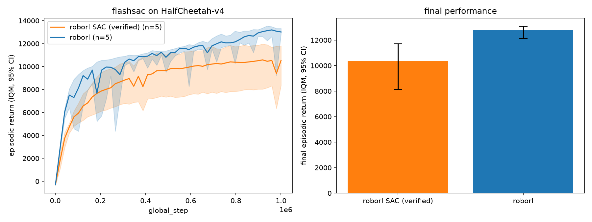
#### Hopper-v4
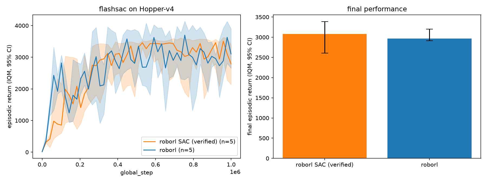
#### Walker2d-v4
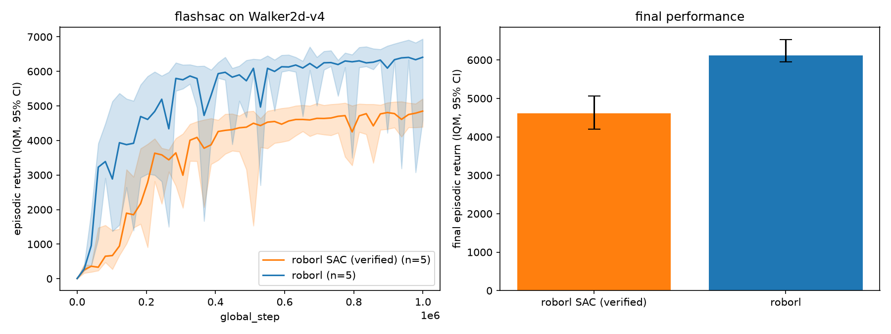

</details>

## How verification works

Each algorithm is verified by re-running it under the reference's exact
hyperparameters, seeds ≥ 5, on the same env version the reference used, and
comparing learning curves with the statistics few-seed RL actually needs:
**IQM with 95% stratified bootstrap confidence intervals** (Agarwal et al.,
NeurIPS 2021). `roborl benchmark fetch` pulls CleanRL's public runs from the
`openrlbenchmark` W&B entity; `roborl benchmark compare` aligns curves,
computes final-performance IQM with CIs, renders a markdown report + figure,
and issues a mechanical verdict: **PASS** when our CI overlaps the
reference's, **INVESTIGATE** otherwise — which triggers the
[debugging protocol](docs/debugging-rl.md) and a lab-notebook entry.
Algorithms without a CleanRL reference go through the same harness against
the best available baseline: FlashSAC compares against our own
CleanRL-verified SAC (and the paper's published curves where they can be
digitised faithfully); HER will verify against SB3/zoo results.

Reports are committed under `benchmarks/reports/` and are the only thing
that flips a status row to `verified ✅`. Details and thresholds:
[docs/benchmarking.md](docs/benchmarking.md).

## Telemetry

Every run logs CleanRL-compatible metric names (`charts/episodic_return`,
`losses/value_loss`, ...) against `global_step`, so roborl curves overlay
reference curves 1:1 in a single W&B workspace. roborl-specific additions
live in `diagnostics/` and `eval/` namespaces. Every run records its config,
git SHA, library versions, and resolved device — results that can't be
traced to a commit don't exist. What each metric means and what its failure
modes look like: [docs/telemetry.md](docs/telemetry.md).

## Roadmap

| Phase | Focus | Envs | Algorithms | Verification reference |
|---|---|---|---|---|
| 0 ✅ | Infrastructure: tooling, telemetry, benchmark harness, docs, CI | — | — (random-agent pipeline check) | — |
| 1 ✅ | Core model-free algorithms | CartPole-v1, Acrobot, Pendulum, (LunarLander w/ box2d), MuJoCo: Hopper, HalfCheetah, Walker2d | SAC, PPO (discrete + continuous) | CleanRL |
| 2 ▶ | Scaling off-policy RL | MuJoCo + high-dimensional control tasks from the paper | FlashSAC ([Kim et al., 2026](https://arxiv.org/abs/2604.04539)): SAC with few-update/large-batch scaling and weight/feature/gradient norm bounding | published results (+ reference code if released) |
| 3 | Goal-conditioned RL | Gymnasium-Robotics Fetch (Reach, Push, PickAndPlace) | HER + SAC | SB3/zoo + published results |
| 4 | Contact-rich manipulation & VLAs | robosuite: Lift, Door, Wipe, NutAssembly, TwoArmPegInHole | FlashSAC/SAC variants; demonstrations, residual RL; then vision-language-action policies (fine-tuning and evaluating open VLA models) as research threads | published results + ablation baselines |

Phase 1 uses locomotion *tasks* purely as standard verification benchmarks —
the destination is manipulation. Phases advance only when the previous
phase's algorithms are `verified ✅`.

## Learning resources

- Huang et al., [CleanRL: High-quality Single-file Implementations of Deep RL Algorithms](https://docs.cleanrl.dev) (JMLR 2022) — the verification oracle; public runs under the [openrlbenchmark](https://wandb.ai/openrlbenchmark/cleanrl) W&B entity
- Agarwal et al., [Deep RL at the Edge of the Statistical Precipice](https://arxiv.org/abs/2108.13264) (NeurIPS 2021) + [rliable](https://github.com/google-research/rliable) — the evaluation methodology
- Huang et al., [The 37 Implementation Details of Proximal Policy Optimization](https://iclr-blog-track.github.io/2022/03/25/ppo-implementation-details/) (ICLR Blog Track 2022) — the model for our per-algorithm spec notes
- Kim et al., [FlashSAC: Fast and Stable Off-Policy Reinforcement Learning for High-Dimensional Robot Control](https://arxiv.org/abs/2604.04539) (2026) — the roadmap's scaling phase
- Andy Jones, [Debugging Reinforcement Learning](https://andyljones.com/posts/rl-debugging.html) — foundation for our debugging protocol
- John Schulman, *The Nuts and Bolts of Deep RL Research*
- [OpenAI Spinning Up](https://spinningup.openai.com) — theory companion
- [Gymnasium](https://gymnasium.farama.org) / [Gymnasium-Robotics](https://robotics.farama.org) / [robosuite](https://robosuite.ai) / [uv PyTorch guide](https://docs.astral.sh/uv/guides/integration/pytorch/) / [W&B docs](https://docs.wandb.ai)
- Sutton & Barto, [Reinforcement Learning: An Introduction](http://incompleteideas.net/book/the-book.html) (2nd ed.)

## Contributing & license

Contributions welcome — see [CONTRIBUTING.md](CONTRIBUTING.md). MIT
licensed ([LICENSE](LICENSE)).
