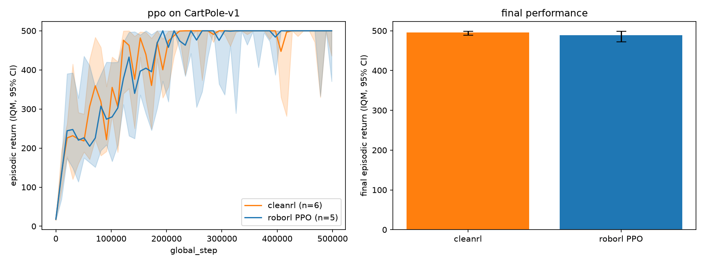

# Verification report: ppo on CartPole-v1

| | |
|---|---|
| Algorithm | `ppo` |
| Environment | `CartPole-v1` |
| Commit | `4ed2bee432de` |
| Our runs | 5 |
| Reference runs | 6 (cleanrl) |
| Final window | last 10% of training |
| **Verdict** | **PASS** |

## Final performance (IQM over final window, 95% stratified bootstrap CI)

| Run set | IQM | 95% CI |
|---|---|---|
| roborl PPO | 488.92 | [472.18, 498.48] |
| cleanrl | 495.35 | [488.34, 498.78] |

## Sample efficiency

## Sources

- Ours: `runs/ppo-CartPole-v1-s1-20260827T211750.csv`, `runs/ppo-CartPole-v1-s2-20260827T211750.csv`, `runs/ppo-CartPole-v1-s3-20260827T211750.csv`, `runs/ppo-CartPole-v1-s4-20260827T211750.csv`, `runs/ppo-CartPole-v1-s5-20260827T211826.csv`
- Reference: `.cache/benchref/openrlbenchmark/ppo/CartPole-v1.parquet`

Verdict policy: see `docs/benchmarking.md`. A PASS means our final IQM's CI
overlaps the reference's (or IQM >= 90% of reference when the reference has
fewer than 3 runs). INVESTIGATE triggers the debugging protocol
(`docs/debugging-rl.md`) and a lab-notebook entry.
